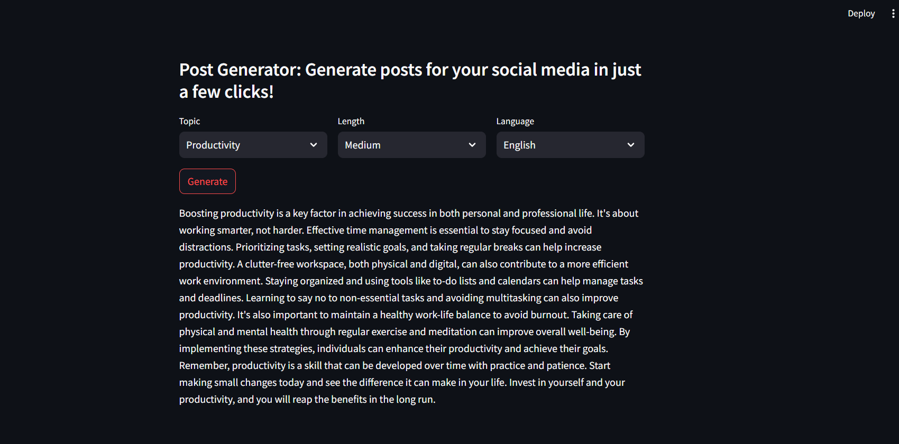

# project-genai-post-generator

Gen AI Post Generator is an AI-powered Streamlit app that helps creators generate LinkedIn posts in a consistent style by learning from their past content. It analyzes existing posts, extracts useful topics, and uses few-shot prompting with an LLM to create new posts based on the selected topic, length, and language.

Tagline: Generate social media content that sounds like you.



Whether you're a LinkedIn influencer, personal brand, or content creator, this tool can help you draft future posts faster while preserving your unique voice and tone.

## Technical Architecture


1. Stage 1: Collect LinkedIn posts and extract Topic, Language, Length etc. from it.
1. Stage 2: Now use topic, language and length to generate a new post. Some of the past posts related to that specific topic, language and length will be used for few shot learning to guide the LLM about the writing style etc.

## Set-up
1. To get started we first need to get an API_KEY from here: https://console.groq.com/keys. Inside `.env` update the value of `GROQ_API_KEY` with the API_KEY you created. 
2. To get started, first install the dependencies using:
    ```commandline
     pip install -r requirements.txt
    ```
3. Run the streamlit app:
   ```commandline
   streamlit run main.py
   ```


